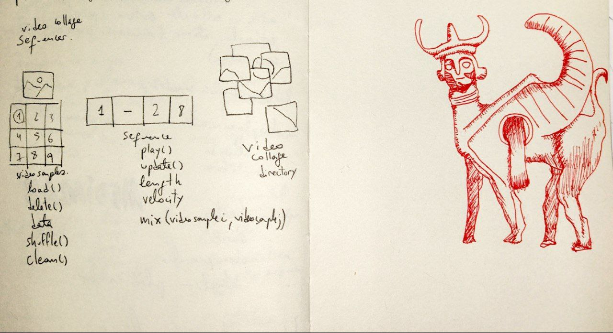

Laura, Say hello to my little video looper

Made with AMOR using python, by Karen Palacio.

> For a very custom type of video.
> a video made of videos.

# Contents

- workflow to generate img2video using ComfyUI 
- other_play.py : quick PoC script version of the sequencer
- sequencer.py : sequencer WIP - meant to run for a collection of videos
- video_player: video player class that uses mpv - meant for a single video

# Dependencies
pip install mpv-python pyautogui

# Usage
## quick & dirty usage (this will not work on your computer)
python3 other_play.py

## actual usage
### with sequencing:
python3 sequencer.py

### without sequencing:
python3 video_player.py

## Correr batch img2video

Tener levantado comfyUI en la url que sea

previamente tenés que haber procesado y subido las imagenes a la compu donde esté corriendo comfyui, y ponerlas en la carpeta input. el nodo Load Images ignora todo el resto de los directorios. Por ej procesalas en tu local y subilas usando jupyter en el nodo de cómputo.

Si querés usar otro workflow distinto al que está acá lo tenés que hacer poniendo a comfyui en modo dev (en el cog en el menú de queue prompt). Eso te permite a un workflow actual guardarlo de la manera API.

ejecutar el script batch_img2video.py y luego por otro lado bajarse los resultados buscandolos en la carpeta outputs dentro de ComfyUI
